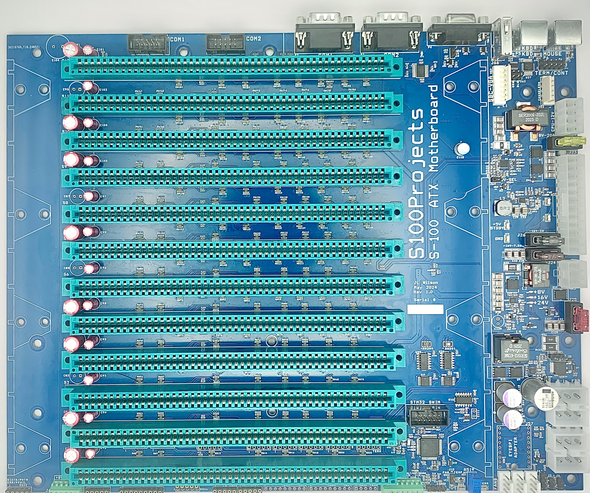
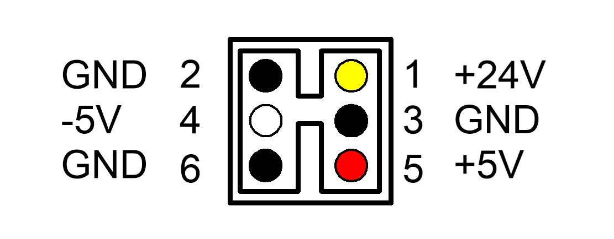

# S-100 ATX Motherboard for PC Cases and Power Supplies # 

## Project Purpose and Goal ##
<b>The S-100 ATX Motherboard uses a 550W or greater ATX PC power supply (PSU) to generate common S-100 Bus voltages for S-100 computers and floppy disk drives.  It can be mounted in ATX Mid Tower and larger cases that provide at least 7-1/4" of space from motherboard mounting plate to the top of the case.</b>

<b>Table of Contents:</b>
- [Project Overview](#project-overview)
  - [STM32 Microcontroller Features](#stm32-microcontroller-features)
  - [S-100 ATX Motherboard Features](#s-100-atx-motherboard-features)
  - [S-100 Voltage Outputs and Currents](#s-100-bus-voltage-outputs-and-currents)
  - [ATX PSU Requirements](#atx-psu-requirements)
  - [S-100 ATX Motherboard Jumper and Connector Assignments](#s-100-atx-motherboard-jumper-and-connector-assignments)
- [S-100 ATX Motherboard Thermal and Current Limits](#s-100-atx-motherboard-thermal-and-current-limits)
  - [S-100 Bus Current and Thermal Limits](#s-100-bus-current-and-thermal-limits)
  - [8-Inch FDD Current and Thermal Limits](#8-inch-fdd-current-and-thermal-limits)
  - [Fan Requirements under High Loads](#fan-requirements-under-high-loads)
- [Installation and Wiring Requirements](#installation-and-wiring-requirements)
  - [S-100 ATX Motherboard Connector Locations](#s-100-atx-motherboard-connector-locations)
  - [Connector Pinout Tables](#connector-pinout-tables)
    - [J1: ATX Main Power Connector](#j1-atx-main-power-connector)
    - [J3: ATX CPU Power Connector](#j3-atx-cpu-power-connector)
    - [J5: ATX PCIE Power Connector](#j5-atx-pcie-power-connector)
    - [J13-14: 8in. Disk DC Power Connectors](#j13-14-8in-disk-dc-power-connectors)
    - [J15: S-100 Bus Power Pins](#j15-s-100-bus-power-pins)
    - [J16: Voltage/Current Monitor Connector](#j16-voltagecurrent-monitor-connector)
    - [J23-26: PC FAN Connectors](#j23-26-pc-fan-connectors)
- [S-100 ATX Motherboard V1 Schematics](#s-100-atx-motherboard-v1-schematics)

## Project Overview ##

To take advantage of the low-cost and availability of PC Cases and Power Supplies, the S-100 ATX Motherboard was created and implemented as a 12.0" x 9.6" ATX standard form factor to match commonly available PC Mid-Tower and larger cases.  At the same time, additional features were added to lower the system costs for a first time S-100 system builder.

An STM32 Microcontroller was added to enable control of non-vintage PC Interfaces and Power Supply Sequencing.  Additional features will be added as the maturity of the project increases and different STM32 Software Modules are added and updated.

### STM32 Microcontroller Features ###

<b>CURRENT RELEASE STM32 SOFTWARE FEATURES:</b>
  - PC Power Switch Control (allows you to turn on/off the ATX PSU and S-100 ATX Motherboard Bus and 8" Drive voltages)
  
<b>NEXT RELEASE STM32 SOFTWARE FEATURES:</b>
  - Target Availability of December 23rd, 2024
  - STM32 USB-Drive Updater (eliminates the need for specialized STM32 programmers)
  - PWM Fan Control via current usage feedback (uses current monitors to drive fan speed)
  - ARGB Color LED Output to give a visual indication of system current load (i.e. heat)

<b>Q1 2025 RELEASE STM32 SOFTWARE FEATURES:</b>
  - Target Availability of March 31st, 2025
  - USB Keyboard to PS/2 or Serial Conversion (enables use of common PC Keyboards with vintage systems)
  - VGA Terminal Emulation (VT100/ANSI to start, others to follow)
  - Front Panel Touchscreen LCD System Monitor (uses Adafruit TFT LCD Display 2090) for:
    - Power Sequencing System Setup
    - Keyboard and Terminal Settings
    - Live and History Displays of voltages and current

### S-100 ATX Motherboard Features ###
The S-100 ATX Motherboard replaces several discrete power supply setups using efficient switching regulator power sections (+7.5V or +8V, +/-16V, and +24V) and a readily available ATX PSU of 550 Watts or greater (See <b>ATX PSU Requirements</b> below).

<b>Current Features:</b>
  - ATX Motherboard Form Factor (12.0" x 9.6")
  - 12-Slot S-100 Bus with Series Terminated Bus Signals and an Active Termination Option
  - STM32 Microcontroller (see <b>STM32 Microcontroller Features</b> above)
  - ATX Power Input Connectors (24-pin, 8-pin and 6-pin)
  - Supports common S-100 Bus Voltages of +7.5V/8V and +/- 16V
  - Supports common 8" Disk Drive Voltages of (+24V, +5V, and -5V)
  - Three 3/4-pin 12V PC Fan Connectors (with Tach and PWM controlled by the STM32)
  - Microprocessor level (0 to 3.3V) voltage and current monitors for S-100 Bus and 8-in FDD voltages
  - Over-current and over-temperature shutdown protection
  - Input fuses for each power supply section

### S-100 Bus Voltage Outputs and Currents ###

  | <b>S-100 Output</b>   | <b>Function</b>                       | <b>Default Fuse Values</b>      |
  |----------------|--------------------------------|-----------------------|
  | <b>+7.5V</b> @ 25.0A   | Main Logic Supply on S-100 Bus | <b>~16.4A</b> (20.0A Fuse)   |
  |     - or -          |                                |                              |
  | <b>+8.0V</b> @ 22.0A   | Main Logic Supply on S-100 Bus | <b>~16.4A</b> (20.0A Fuse)   |
  | <b>+16V</b> @ 4.0A     | Logic/Shifter/Analog Supply    | <b>~5.7A</b>   (7.5A Fuse)   |
  | <b>-16V</b> @ 0.5A     | Level Shifter/Analog Supply    | <b>~0.8A</b>   (2.0A Fuse)   |
  | <b>+24V</b> @ 4.0A     | 8in. Floppy Drive Supply       | <b>~8.8A</b>  (10.0A Fuse)   |
  | <b>-5V</b> @ 0.3/0.5A\* | 8in. Floppy Drive Supply       | <b>Int. Limited to 0.5A</b>  |
  | <b>+5V</b> \*\*          | 8in. Floppy Drive Supply       | <b>Limited by ATX PSU</b>    |

\* = 0.3A when -5V Regulator is supplied by -16V Switcher.  
\* = 0.5A when -5V Regulator is supplied by -12V from ATX PSU.  
\*\* = Limited by ATX PSU.

Since not all ATX PSU's supply a -12V voltage (used by the on-board -5V regulator for the 8-in. Floppy Drive Power Connectors), a jumper is provided to optionally supply this -5V regulator from the -16V supply that the S-100 ATX Motherboard generates.  Due to dissipation reasons, the current output of the -5V regulator is reduced to 0.3A when driven from the -16V supply.

### ATX PSU Requirements ###

The main determination of which ATX PSUs are acceptable are driven by the 12V load of the S-100 ATX Motherboard itself, the maximum load present on its outputs (S-100 Bus and 8-inch FDD), and any external +12V accessories.  If you will be using the S-100 ATX Motherboard at its maximum load limits (as shown above) then you will need at least <b>32 amps</b> at 12V.  However, additional 12V loads such as Fans, Hard-Drives, LEDs, et cetera, will raise this requirement.  As a general rule, it is advised to add 5% or 10% margin to the current requirements to account for unanticipated loads or losses. 

### S-100 ATX Motherboard Jumper and Connector Assignments ###

  | <b>Reference Des</b>  | <b>Description</b>                    | <b>Default Setting/Voltages/Usage</b> |
  |----------------|--------------------------------|-----------------------|
  | <b>J1  - 24-Pins</b>  | ATX Main Power Cable           | +3.3V, +5.0V, +12V, -12V                |
  | <b>J2  - 2-Pins</b>    | ATX Power Switch Connection    | Short pins for ATX PSU Always On        |
  | <b>J3  - 8-Pins</b>    | ATX 12V CPU Power Cable        | +12V when ATX PSU is On                 |
  | <b>J4  - 3-Pins</b>    | ATX Power LED Connection       | Pin 1 - Anode, 3 - Cathode              |
  | <b>J5  - 6-Pins</b>    | ATX 12V PCIE Power Cable       | +12V when ATX PSU is On                 |
  | <b>J6  - 2-Pins</b>    | S-100 Reset Switch Input       | Produces Resets on S-100 Bus            |
  | <b>J7  - 3-Pins</b>    | -5V In Select (-12/-16)        | 1-2=-12V, 2-3=-16V                      |
  | <b>J12 - 2-Pins</b>    | PC Power Switch                | Upper two pins go to PC Power Switch    |
  | <b>J13/14 - 6-Pins</b> | 8-in Drive Power Sockets       | 2/3/6=GND, 1=+24V, 4=-5V, 5=5V          |
  | <b>J16 - 8-Pins</b>    | Voltage/Current Monitor Output | (See V/I Monitor Pinout)                |
  | <b>J18-20 - 4-Pins</b> | PC Fan Connections             | 1=GND, 2=+12V, 3=TACH, 4=PWM            |
  | <b>J23-26 - 2-Pins</b> | Power Supply Fuses             | J23=+7.5V, J24=+16V, J25=+24V, J26=-16V |
  | <b>J48-49 - 10-Pins</b>| External RS-232 COM1-COM2      | Used to connect to external P2-3        |
  | <b>J50  - 8-Pins</b>   | External VGA                   | Used to connect to external P4          |
  | <b>J52  - 6-Pins</b>   | Keyboard/Mouse PS/2 Connector  | Used to connect P5-6 to S-100 PS/2 Ports|
  | <b>J57  - 18-Pins</b>  | EYESPI Board Socket for FP     | SPI Connection to Front Panel Display   |
  | <b>J58  - 10-Pins</b>  | ST-SWIM Programming Interface  | Used for initial updates of STM32 FW    |
  | <b>J61  - 2-Pins</b>   | VGA +5V Enable                 | Used to enable +5V to P4 pin 9          |
  | <b>J63  - 6-Pins</b>   | RGB Color Select for VGA Out   | Used to select color mix for VGA P4 Out |
  | <b>J64  - 2-Pins</b>   | 7.5V/8V Select for S-100 Cards | Shorted = +8V, Open = +7.5V             |
  | <b>J65 - 6-Pins</b>    | S-100 Bus Voltage Outputs      | 1/2=+7.5V, 3/4=GND, 5=+16V, -16V        |
  | <b>J66 - 5-Pins</b>    | STM32 USB Type A Connection    | Used for USB Keyboard and Firmware Updates |
  | <b>J67 - 4-Pins</b>    | ARGB LED Connector             | +5V ARGB LED Port                       |
  | <b>S1-S12 - 100-Pins<b> | S-100 Bus Connectors           | S-100 Card Slots                        |
  
## S-100 ATX Motherboard Thermal and Current Limits ##

As shown above, the S-100 ATX Motherboard S-100 Power Supply Board can provide >350W of S-100 Bus and 8-inch FDD voltages, typically at 95%+ efficiency.

Even at those efficiency levels though, you will still have close to 18-watts of heat dissipation at full load.  The board can dissipate, with natural convection (under 25C ambient conditions), up to approximately 12-watts of heat safely without the need of a fan in a typical 25C environment. (Note - most of this heat is generated by the 7.5V/8.0V and +24V regulator sections of the board).  Above that limit, a 90mm or larger fan, blowing across the power supply section, is required to avoid thermal shutdowns and possible damage to the S-100 ATX Motherboard.  Fans mounted on the 3D printer S-100 Card Cage Guides can usually meet this requirement, but the final installation should be checked for air flow across the power supply section using a piece of tissue to gauge the air movement.

Also, depending on the direction and flow rate of the PC Case fans, the additional fan mounts on the S-100 Card Cage Guides may not be needed, however the 90mm fans on the Card Cage act as insurance again localized heat buidup from the S-100 Cards' on-board regulators.

### S-100 Bus Current and Thermal Limits ###

Due to the thermal constraints shown above, the current limits for the +7.5V and +8V versions of the S-100 ATX Motherboard are catagorized into four catagories according to these operational limits.  The categories are +7.5V vs +8V and Fanless vs Fan cooling.

  | <b>Operational Mode</b> | <b>Current Limit</b> | 
  |------------------|-----------------|
  | <b>7.5V - No Fan</b>    | 17 Amps       |
  | <b>8.0V - No Fan</b>    | 15 Amps       |
  | <b>7.5V - 60mm Fan</b>  | 25 Amps       |
  | <b>8.0V - 60mm Fan</b>  | 22 Amps       |

  These are characterized limits, but convection currents, airflow patterns, and venting efficiencies within different enclosures can vary wildly, so please error on the side of caution.  More airflow is generally better. 

  The +16V section takes advantage of a lower voltage and more efficient MOSFET than can be used in the 24V section (primarily because the higher switching voltages in the 24V section did not allow for using the lower voltage MOSTFET).

  However, since the +16V section does use the more efficient MOSFET, it does not require a fan to achieve its full loading of 4-amps.  A fan may still be required depending on the loading for the other output voltages.

  The -16V section (at 0.5A maximum) is more limited in its output current, since this supply rail is generally just used for RS-232 I/O output and has limited current draw.

### 8-Inch FDD Current and Thermal Limits ###

The +24V 8-Inch floppy disk drive power supply section behaves similarly to that of the +7.5v/+8V section.  Above 2.7-amps of continuous loading, a fan is required.  Floppy disk driver startup currents are generally not a factor in the thermal limits described here, but continuously driven head stepper motor current can be excessive.  If in doubt, check the current indication on the current monitor port with one drive connected before adding additional drives to the secondary 8-Inch FDD power port.

### Fan Requirements under High Loads ###

Regardless of the individual current loadings, whenever the +7.5V/+8V or +24V output currents are 70% or higher of the total rated current limits, a fan should be used.

## Installation and Wiring Requirements ##

For the lowest voltage drop (cable loss) of the power cables to the 8in. Drives, please follow the following chart for wire sizes according to load current:

  | <b>Output @ Amps</b>   | <b>Wire Type</b>                       | <b>Wire Gauge</b>      |
  |----------------|--------------------------------|-----------------------|
  | <b>+24V</b>  @ 4.0A  (J13/14) | 1-Wire 7-strand or higher copper | <b>18 or 20-Guage</b>|
  | <b>-5V</b>   @ 0.5A  (J13/14) | 1-Wire 7-strand or higher copper | <b>18 or 20-Guage</b>|
  | <b>+5V</b>   @ 4.0A  (J13/14) | 1-Wire 7-strand or higher copper | <b>18 or 20-Guage</b>|

NOTE: On PVC vs THHN - THHN (Teflon Coated Wire) does not increase the current carrying capability of a wire.  It does increase the temperature rating before failure.  Simply put, it can dissipate more heat so a smaller wire can be used, but it comes at the cost of a larger voltage drop and more losses in the cable.  However, THHN can be used at the above wire guage limits as it offers better abrasion resistance, heat tolerance, and is easier to pull through tight spaces due to its Teflon coating.

### S-100 ATX Motherboard Connector Locations ###

The following diagram shows the various connector locations:

For a zoomable image, please download the PDF file below and zoom into the smaller details as required.

[S-100 ATX Motherboard Connector Locations PDF File](Docs/s100_atx_mb_v1_board_diagram.pdf "S-100 ATX Motherboard Connector Locations.PDF")

It is recommended that the S-100 ATX Motherboard be mounted in a case with standoffs of at least 0.25" to allow for airflow underneath the PCB for cooling at high loads, and to reduce the possibility of a connector short to the main chassis.

### Connector Pinout Tables ###

#### J1: ATX Main Power Connector ####

  | <b>Pin Number </b>   | <b>ATX Function</b>                       | <b>S-100 ATX Motherboard Use</b>      |
  |----------------|--------------------------------|-----------------------|
  | <b>1</b>     | +3.3V | <b>Bias Voltage for Fans and LEDs</b>      |
  | <b>2</b>     | +3.3V | <b>Bias Voltage for Fans and LEDs</b>      |
  | <b>3</b>     | Ground | <b>Ground for Board</b>|
  | <b>4</b>     | +5.0V | <b>Bias Voltage and LED Supply</b>|
  | <b>5</b>     | Ground | <b>Ground for Board</b>|
  | <b>6</b>     | +5.0V | <b>Bias Voltage and LED Supply</b>|
  | <b>7</b>     | Ground | <b>Ground for Board</b>|
  | <b>8</b>     | Power OK | <b>Used to enable on board regulators</b>|
  | <b>9</b>     | +5V Standby | <b>Connected to PWREN Pin 2 for external use</b>|
  | <b>10</b>    | +12.0V | <b>Used as main supply for on-board regulators</b>|
  | <b>11</b>    | +12.0V | <b>Used as main supply for on-board regulators</b>|
  | <b>12</b>    | +3.3V | <b>Bias Voltage for Fans and LEDs</b>      |
  | <b>13</b>    | +3.3V | <b>Bias Voltage for Fans and LEDs</b>      |
  | <b>14</b>    | -12V (if supported) | <b>Input to -5V Regulator</b>      |
  | <b>15</b>    | Ground | <b>Ground for Board</b>|
  | <b>16</b>    | Power Switch Input | <b>Connected to PWREN Pin 4</b>|
  | <b>17</b>    | Ground | <b>Ground for Board</b>|
  | <b>18</b>    | Ground | <b>Ground for Board</b>|
  | <b>19</b>    | Ground | <b>Ground for Board</b>|
  | <b>20</b>    | No Connect | <b>Not Used</b>|
  | <b>21</b>    | +5.0V | <b>Bias Voltage and LED Supply</b>|
  | <b>22</b>    | +5.0V | <b>Bias Voltage and LED Supply</b>|
  | <b>23</b>    | +5.0V | <b>Bias Voltage and LED Supply</b>|
  | <b>24</b>    | Ground | <b>Ground for Board</b>|

#### J3: ATX CPU Power Connector ####

  | <b>Pin Number </b>   | <b>ATX Function</b>                       | <b>S-100 ATX Motherboard Use</b>      |
  |----------------|--------------------------------|-----------------------|
  | <b>1</b>     | Ground | <b>Ground for Board</b>|
  | <b>2</b>     | Ground | <b>Ground for Board</b>|
  | <b>3</b>     | Ground | <b>Ground for Board</b>|
  | <b>4</b>     | Ground | <b>Ground for Board</b>|
  | <b>5</b>     | +12.0V | <b>Used as main supply for on-board regulators</b>|
  | <b>6</b>     | +12.0V | <b>Used as main supply for on-board regulators</b>|
  | <b>7</b>     | +12.0V | <b>Used as main supply for on-board regulators</b>|
  | <b>8</b>     | +12.0V | <b>Used as main supply for on-board regulators</b>|

#### J5: ATX PCIE Power Connector ####

  | <b>Pin Number </b>   | <b>ATX Function</b>                       | <b>S-100 ATX Motherboard Use</b>      |
  |----------------|--------------------------------|-----------------------|
  | <b>1</b>     | +12.0V | <b>Used as main supply for on-board regulators</b>|
  | <b>2</b>     | +12.0V | <b>Used as main supply for on-board regulators</b>|
  | <b>3</b>     | +12.0V | <b>Used as main supply for on-board regulators</b>|
  | <b>4</b>     | Ground | <b>Ground for Board</b>|
  | <b>5</b>     | Ground | <b>Ground for Board</b>|
  | <b>6</b>     | Ground | <b>Ground for Board</b>|

#### J13-14: 8in. Disk DC Power Connectors ####

  | <b>Pin Number </b>   | <b>S-100 ATX Motherboard Function</b>    | <b>S-100 ATX Motherboard Use</b>      |
  |----------------|--------------------------------|-----------------------|
  | <b>1</b>     | +24V   | <b>+24V @ 4A supply for Disk Drives</b>|
  | <b>2</b>     | Ground | <b>Ground for Disk Drives</b>|
  | <b>3</b>     | Ground | <b>Ground for Disk Drives</b>|
  | <b>4</b>     | -5V    | <b>-5V supply | <b>-5V @ 0.3A/0.5A for Disk Drives\*</b>|
  | <b>5</b>     | +5V    | <b>+5V supply for Disk Drives (supplied by ATX +5V)</b>|
  | <b>6</b>     | Ground | <b>Ground for Disk Drives</b>|

\* = Supplied by ATX -12V (@ 0.5A) or -16V S-100 Supply (@ 0.3A)

#### J15: S-100 Bus Power Pins ####

  | <b>Pin Number </b>   | <b>S-100 ATX Motherboard Function</b>    | <b>S-100 ATX Motherboard Use</b>      |
  |----------------|--------------------------------|-----------------------|
  | <b>1</b>     | +7.5V/+8V | <b>+7.5V/+8V up to 25A/22A for S-100 Bus</b>|
  | <b>51</b>     | +7.5V/+8V | <b>+7.5V/+8V up to 25A/22A for S-100 Bus</b>|
  | <b>2</b>     | +16V   | <b>+16V up to 4A for S-100 Bus</b>|
  | <b>52</b>     | -16V   | <b>-16V up to 0.5A for S-100 Bus</b>|
  | <b>50</b>     | Ground | <b>Ground return for S-100 Bus</b>|
  | <b>100</b>     | Ground | <b>Ground return for S-100 Bus</b>|
  | <b>20</b>     | Ground* | <b>IEEE-696 Ground Pin, remove resistor for non-IEEE-696</b> |
  | <b>70</b>     | Ground* | <b>IEEE-696 Ground Pin, remove resistor for non-IEEE-696</b> |
 
 * = These pins are additional ground pins in the IEEE-696 Specification to provide a lower impedance ground path for IEEE-696 compliant S-100 Cards.  The ground connections for these pins are through 0-ohm 0603 surface mount resistors.  If required for front panel S-100 systems, these resistors can be removed to enable the UNPROTECT (pin 20) and RUN (pin 70) signals.

#### J16: Voltage/Current Monitor Connector ####

The Voltage/Current Monitor signals allow for the use of a micro-controller or programmable Panel Meter to monitor and display the S-100 and 8-inch Drive power supply voltages and curents.  These signals will also be used to calculate FAN RPM according to system current load.

  | <b>Pin Number </b>   | <b>S-100 ATX Motherboard Function</b>         | <b>S-100 ATX Motherboard Use</b>      |
  |----------------|--------------------------------|-----------------------|
  | <b>1</b>     | 8VS: +7.5V/8V Voltage Sense  | <b>8.0V = 2.0V +/-5%</b>|
  | <b>2</b>     | 8VIS: +7.5V/8V Current Sense   | <b>25A = 2.5V +/-5%</b>|
  | <b>3</b>     | 16VS: +16V Voltage Sense  | <b>15.0V = 4.0V +/-5%</b>|
  | <b>4</b>     | Ground | <b>Ground for Signals</b>|
  | <b>5</b>     | Ground | <b>Ground for Signals</b>|
  | <b>6</b>     | 16VIS: +16V Current Sense  | <b>2.5A = 1.24V +/-10%</b>|
  | <b>7</b>     | 24VS: +24V Voltage Sense   | <b>24.0V = 2.4V +/-5%</b>|
  | <b>8</b>     | 24VIS: +24V Current Sense  | <b>2.5A = 1.24V +/-10%</b>|

#### J23-26: PC FAN Connectors ####

  | <b>Pin Number </b>   | <b>S-100 ATX Motherboard Function</b>                       | <b>S-100 ATX Motherboard Use</b>      |
  |----------------|--------------------------------|-----------------------|
  | <b>1</b>     | Ground | <b>Ground for Fans</b>|
  | <b>2</b>     | +12.0V | <b>+12V Supply to PC Fan</b>|
  | <b>3</b>     | TACH   | <b>Tach output from Fan (Not Used)</b>|
  | <b>4</b>     | PWM    | <b>PWM Input for Fan</b>|

n.b. - Pin 1 is at the bottom of the connector in the above diagram.

## S-100 ATX Motherboard V1 Schematics ##

The following schematic is provided for reference.

[S-100 ATX Motherboard V1 Schematics PDF File](Docs/S100_ATX_MB_V1_Schematic.pdf "S-100 ATX Motherboard V1 Schematics PDF File")
